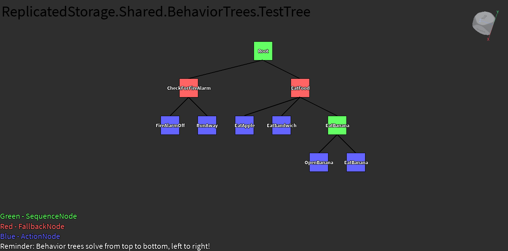

# RbxBehaviorTreeVisualizer

A Roblox Studio plugin for visualizing and debugging behavior trees created with the [RbxBehaviorTree](https://github.com/Fangous/RbxBehaviorTree/) package.

## Installation

You can get the latest version of this plugin here: https://create.roblox.com/store/asset/93075433602329/

## Preview

Example screenshot of the plugin:

    

